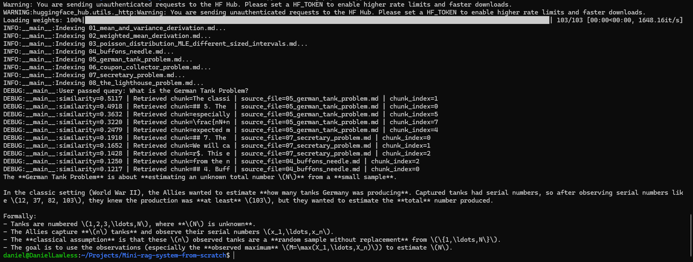
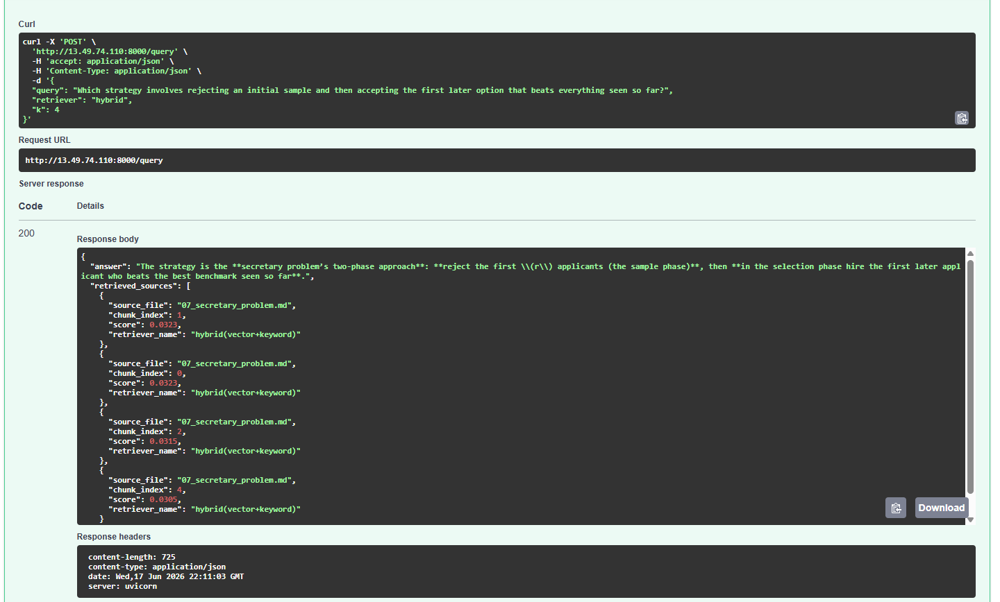
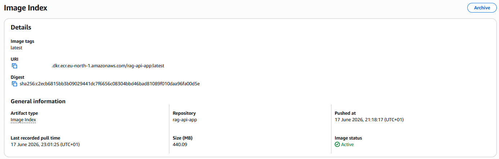
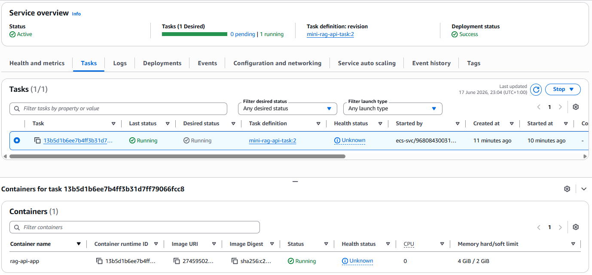
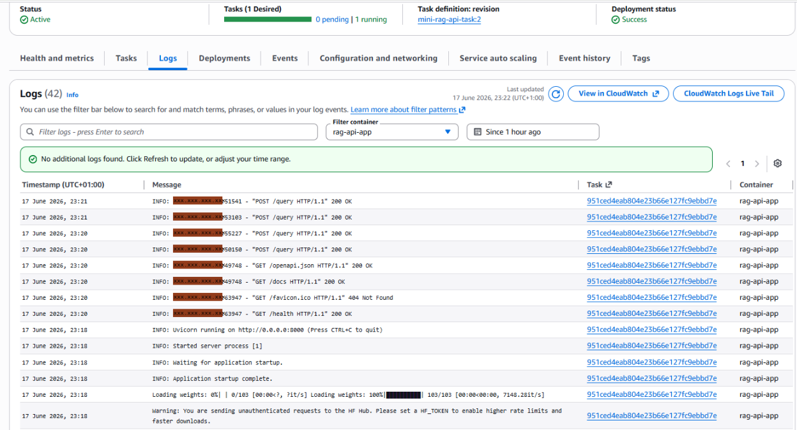
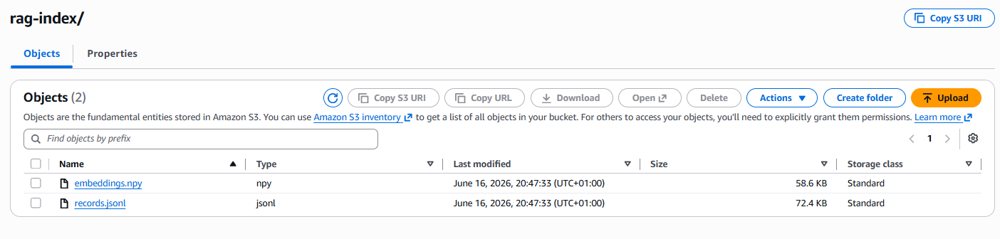

# Mini RAG System From Scratch

A Retrieval-Augmented Generation system built from scratch in Python for querying my own mathematical statistics and probability derivation notes.

This project started as a learning exercise in RAG fundamentals, but developed into a more complete mini ML/LLM systems project with:

* recursive chunking
* vector search
* BM25 keyword search
* hybrid retrieval with Reciprocal Rank Fusion
* persistent index storage
* retrieval evaluation
* automated tests
* GitHub Actions CI
* FastAPI serving
* Docker support
* AWS deployment test using ECR, ECS/Fargate, and S3

The project was intentionally built mostly from scratch rather than using a full RAG framework such as LangChain. The goal was to understand how the core pieces of a RAG system work internally.

---

## Motivation

The motivation for this project came from a real problem I was facing.

I had started creating a portfolio of mathematical statistics and probability derivations using Excalidraw's Math Preview. As the number of derivations grew, it became harder to quickly find the exact derivation, explanation, or pattern I was looking for.

Rather than manually searching through my derivations, I wanted to build a system that could retrieve the most relevant parts of my notes and use an LLM to answer questions about them.

Recognising this as a retrieval problem, I built a mini RAG system that:

* indexes my own derivation notes
* splits them into chunks
* embeds each chunk
* stores the index persistently
* retrieves relevant chunks using vector, keyword, or hybrid search
* passes the retrieved context into an LLM to generate grounded answers

---

## Knowledge Base

This project uses my separate statistics derivation repository as its knowledge base:

[Statistics for AI](https://github.com/Daniel-Lawless/Statistics-for-ai)

That repository contains my original human-readable derivation notes, written in Markdown. The notes cover probability and statistics problems relevant to AI and machine learning, including:

* Lighthouse Problem
* Buffon's Needle
* German Tank Problem
* Coupon Collector Problem
* Secretary Problem
* inverse-variance weighting
* maximum likelihood estimation
* other statistics and machine learning topics

For this RAG system, I keep a processed copy of those notes inside the `data/` directory. The files are based on the original notes, but are adapted slightly for retrieval. For example, I added short text descriptions around diagrams and images so that the RAG system can understand their meaning without needing OCR or image-processing capabilities.

---

## What I Built

I built a Retrieval-Augmented Generation pipeline from scratch in Python for querying my own mathematical statistics derivation notes.

The system takes Markdown files from the `data/` directory, splits them into overlapping chunks, embeds each chunk, stores the chunks and metadata in a persistent index, retrieves the most relevant chunks for a user query, and passes those chunks into an LLM to generate an answer.

A high-level overview of the system is as follows:

<div align="center">

<pre align="center">
Markdown notes
↓
Recursive chunking
↓
Embedding generation
↓
Persistent index storage
↓
Vector / keyword / hybrid retrieval
↓
Prompt construction
↓
LLM response generation
</pre>

</div>

---

## Core Features

* **Recursive chunking**

  The system splits Markdown notes using natural document structure where possible. It first tries to split by paragraphs, then sentences, then newlines, before falling back to fixed-size word chunks. This helps keep related explanations, equations, and definitions together.

* **Chunk overlap**

  Each chunk can include words from the previous chunk. This helps preserve context when an explanation continues across a chunk boundary.

* **Metadata-aware indexing**

  Each indexed chunk stores its text, source file, and chunk index. This makes retrieval easier to inspect and debug because each result can be traced back to the original Markdown file.

* **Persistent index storage**

  The system saves indexed records to `records.jsonl` and embeddings to `embeddings.npy`. This means the index can be loaded again later without rebuilding the whole corpus every time.

* **Normalised embeddings**

  Text is embedded using an embedding model, then each embedding is normalised. This allows cosine similarity to be calculated efficiently using a dot product.
  
* **Vector search**

  The vector retriever embeds the user query and compares it against the saved chunk embeddings. It returns the chunks with the highest similarity scores.

* **Vectorised NumPy search**

  Instead of comparing embeddings one by one, the system stacks all chunk embeddings into a NumPy matrix. Search is then performed using matrix multiplication, making retrieval much faster.

* **BM25 keyword search**

  The keyword retriever uses BM25 scoring to find chunks that contain important query terms. It considers term frequency, document frequency, and chunk length to rank keyword matches.

* **Hybrid retrieval**

  The hybrid retriever combines vector search and keyword search using weighted Reciprocal Rank Fusion. This allows the system to benefit from both semantic similarity and exact keyword matching.

* **Adjustable retrieval methods**

  The system supports `vector`, `keyword`, and `hybrid` retrieval. This makes it easy to compare different retrieval strategies from both the CLI and API.

* **Command-line interface**

  The CLI supports indexing, asking questions, clearing indexes, and choosing the retrieval method. It can also rebuild indexes locally or upload them to S3.

* **S3 index support**

  The system can store and load indexes from AWS S3. This makes the project more deployment-friendly because the API can download the index at startup instead of relying only on local files.

* **FastAPI interface**

  The API exposes a `/query` endpoint that accepts a question, retrieval method, and number of chunks to retrieve. It returns the generated answer along with the retrieved source files and chunk indexes.

* **Grounded answer generation**

  Retrieved chunks are combined into a context block and passed to the language model. The model is instructed to answer the query using only the retrieved context. If the answer is not present in the context, it is instructed to say it does not know.

* **Retrieval evaluation**

  The project includes an evaluation script that compares vector, keyword, and hybrid retrieval. It calculates metrics such as
  * `hit@k`
  * `precision@k`
  * `correct_source_count@k`
  * `mean_reciprocal_rank@k`
    
  It saves this data into JSON files: `results.json` and `per_question_results.json`. These can be used to see which retriever is performing best on the provided questions in     `questions.json`.

---

## Evaluation

To compare retrieval quality, I built an evaluation pipeline using a labelled set of questions and expected source documents (can be found in `eval/question.json`). Each retriever was evaluated on whether it returned relevant chunks in the top k results (4 in this example), allowing vector, keyword, and hybrid retrieval strategies to be compared directly.

<div align="center">
  
| Retriever | Hit@4 | Avg Correct Sources@4 | Precision@4 | MRR@4 |
|---|---:|---:|---:|---:|
| Vector | 1.0000 | 2.8810 | 0.7202 | 0.9563 |
| Keyword | 0.9762 | 2.6905 | 0.6726 | 0.9325 |
| Hybrid | 1.0000 | 2.9286 | 0.7321 | 0.9425 |

</div>

The hybrid retriever achieved the strongest overall source quality, with the highest Precision@4 and average number of correct sources returned. Vector search achieved the highest MRR@4, meaning it most consistently ranked a relevant source near the top of the results.

This evaluation helped validate that combining semantic search with keyword-based BM25 retrieval improved retrieval reliability, especially when questions depended on both conceptual similarity and exact technical terminology.

---

## Architecture

<div align="center">

<pre align="center">
data/
Markdown knowledge base
↓
Chunking
↓
Embeddings
↓
IndexManager
↓
records.jsonl + embeddings.npy
↓
VectorSearch / KeywordSearch / HybridSearch
↓
RAGPipeline
↓
OpenAI LLM response
↓
CLI or FastAPI
</pre>

</div>

---

## Example Queries

### Buffon's Needle

Example query:

```text
What is the final probability for Buffon's Needle?
```

The system retrieves chunks from the Buffon's Needle notes and uses the retrieved context to answer the question.

<p align="center">
  
</p>

---

### German Tank Problem

Example query:

```text
What is the German Tank Problem?
```

The system retrieves chunks from the German Tank Problem notes and uses the retrieved context to answer the question.

<p align="center">
  
</p>

---

## API Example

The FastAPI application exposes a `/query` endpoint.

Example request:

```json
{
  "query": "Why does the lighthouse problem produce a Cauchy distribution?",
  "retriever": "hybrid",
  "k": 4
}
```

Example deployed API response from Swagger UI:

<p align="center">
  
</p>

---

## Deployment Evidence

### Docker image pushed to ECR

<p align="center">
  
</p>

---

### ECS task running

<p align="center">
  
</p>

---

### Application startup and request logs

<p align="center">
  
</p>

---

### Saved index in S3

<p align="center">
  
</p>

---

## Project Structure

```text
Mini-rag-system-from-scratch/
├── .github/
│   └── workflows/
│       └── ci.yml
├── assets/
│   └── project screenshots and diagrams
├── data/
│   └── processed Markdown knowledge base
├── eval/
│   └── retrieval evaluation questions and results
├── notes/
│   └── development notes and progress log
├── src/
│   ├── api.py
│   ├── chunking.py
│   ├── cli.py
│   ├── embeddings.py
│   ├── evaluation.py
│   ├── hybrid_search.py
│   ├── index_loader.py
│   ├── index_manager.py
│   ├── keyword_search.py
│   ├── logging_config.py
│   ├── rag_pipeline.py
│   └── vector_search.py
├── tests/
│   ├── test_chunking.py
│   ├── test_hybrid_search.py
│   ├── test_index_manager.py
│   ├── test_keyword_search.py
│   └── test_vector_search.py
├── Dockerfile
├── README.md
└── requirements.txt
```

---

## Tech Stack

* Python
* NumPy
* OpenAI API
* FastAPI
* Pydantic
* Uvicorn
* Pytest
* GitHub Actions
* Docker
* AWS ECR
* AWS ECS/Fargate
* AWS S3

---

## How to Run Locally

### 1. Clone the repository

```bash
git clone https://github.com/Daniel-Lawless/Mini-rag-system-from-scratch.git
cd Mini-rag-system-from-scratch
```

---

### 2. Create and activate a virtual environment

Linux/macOS:

```bash
python3 -m venv venv
source venv/bin/activate
```

Windows PowerShell:

```powershell
python -m venv venv
venv\Scripts\Activate.ps1
```

---

### 3. Install dependencies

```bash
pip install -r requirements.txt
```

---

### 4. Set your OpenAI API key

Linux/macOS:

```bash
export OPENAI_API_KEY="your_api_key_here"
```

Windows PowerShell:

```powershell
$env:OPENAI_API_KEY="your_api_key_here"
```

---

## Run from the CLI

Example hybrid retrieval query:

```bash
python src/cli.py ask "Why does the lighthouse problem produce a Cauchy distribution?" --retriever hybrid -k 4
```

Example vector retrieval query:

```bash
python src/cli.py ask "What is the German Tank Problem?" --retriever vector -k 4
```

Example keyword retrieval query:

```bash
python src/cli.py ask "BM25 keyword search" --retriever keyword -k 4
```

---

## Run the FastAPI App Locally

Start the API:

```bash
uvicorn src.api:app --reload
```

Then open:

```text
http://127.0.0.1:8000/docs
```

Example request body:

```json
{
  "query": "What is Buffon's Needle?",
  "retriever": "hybrid",
  "k": 4
}
```

---

## Run with Docker

Build the Docker image:

```bash
docker build -t mini-rag-api .
```

Run the container:

```bash
docker run --rm -p 8000:8000 -e OPENAI_API_KEY=$OPENAI_API_KEY mini-rag-api
```

If using a local mounted index:

```bash
docker run --rm -p 8000:8000 \
  -e OPENAI_API_KEY=$OPENAI_API_KEY \
  -v $(pwd)/storage/index:/app/storage/index \
  mini-rag-api
```

---

## Run Tests

```bash
pytest
```

---

## Run Retrieval Evaluation

```bash
python src/evaluation.py
```

The evaluation pipeline compares retrieval strategies using:

* vector retrieval
* keyword retrieval
* hybrid retrieval

The results are saved as JSON files inside the evaluation output directory.

---

## What I Learned

Building this project helped me understand the core parts of a RAG system from first principles.

The main lessons were:

* RAG quality depends heavily on retrieval quality.
* Chunking strategy has a large effect on answer quality.
* Metadata makes retrieval much easier to debug.
* Normalised embeddings simplify cosine similarity.
* Vectorised search is much faster and cleaner than looping through records manually.
* BM25 is useful for exact technical term matching.
* Hybrid retrieval is more robust than vector or keyword search alone.
* Retrieval quality should be evaluated with metrics rather than only manual inspection.
* Tests and CI make the project safer to refactor.
* Docker and cloud deployment introduce practical engineering concerns beyond the core ML/RAG logic.

---

## Limitations

Current limitations include:

* Images and diagrams are not processed directly.
* The LLM relies on the retrieved context, so poor retrieval can still lead to weak answers.
* The project does not currently include a frontend.
* The agentic RAG layer is planned but not yet implemented.

---

## Future Improvements

Future improvements could be:

* Add an agentic RAG layer for query planning and retrieval strategy selection.
* Add query rewriting when retrieval results are weak.
* Add evidence checking before answer generation.
* Add a small frontend for interacting with the deployed API.
* Compare different chunk sizes, overlap values, and embedding models.

---

## Completed Roadmap

- [x] Build an in-memory vector database
- [x] Add cosine similarity search
- [x] Add chunking with overlap
- [x] Connect retrieved chunks to OpenAI generation
- [x] Add metadata storage for chunks
- [x] Improve chunking with paragraph/sentence-aware splitting
- [x] Vectorise search using NumPy matrix multiplication
- [x] Add persistent index storage
- [x] Add command-line interface
- [x] Add BM25 keyword search
- [x] Add hybrid retrieval with Reciprocal Rank Fusion
- [x] Add retrieval evaluation
- [x] Add Pytest test suite
- [x] Add GitHub Actions CI
- [x] Add FastAPI application
- [x] Add Docker support
- [x] Test AWS deployment using ECR, ECS/Fargate, and S3
